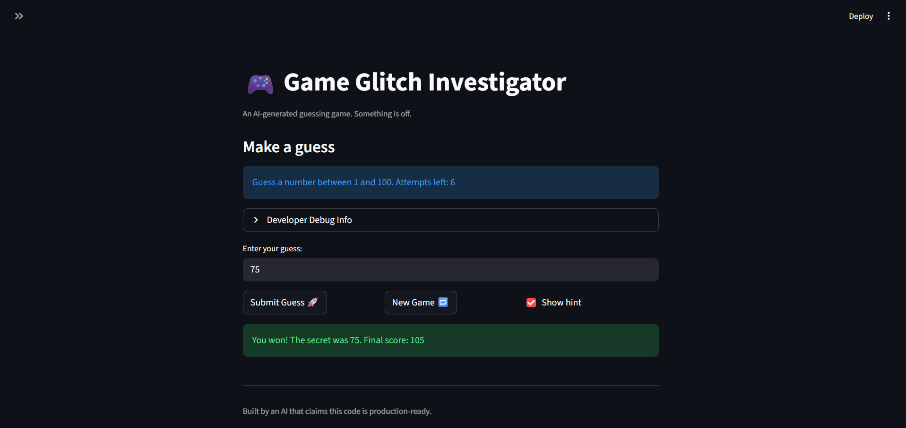
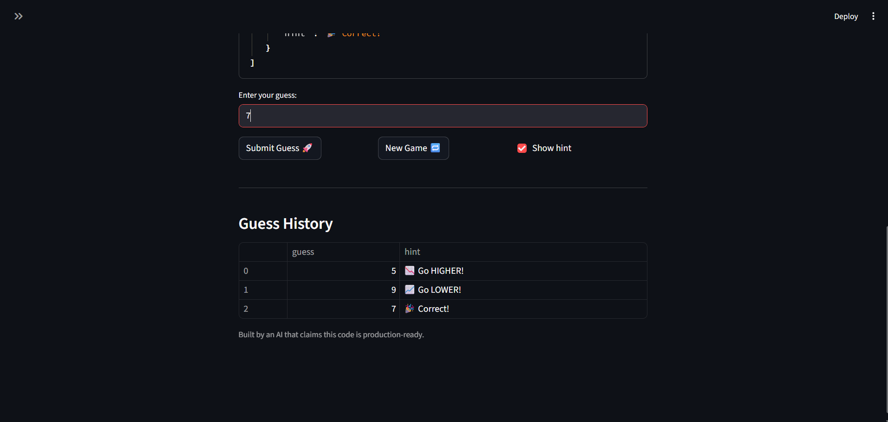

# 🎮 Game Glitch Investigator: The Impossible Guesser

## 🚨 The Situation

You asked an AI to build a simple "Number Guessing Game" using Streamlit.
It wrote the code, ran away, and now the game is unplayable. 

- You can't win.
- The hints lie to you.
- The secret number seems to have commitment issues.

## 🛠️ Setup

1. Install dependencies: `pip install -r requirements.txt`
2. Run the broken app: `python -m streamlit run app.py`

## 🕵️‍♂️ Your Mission

1. **Play the game.** Open the "Developer Debug Info" tab in the app to see the secret number. Try to win.
2. **Find the State Bug.** Why does the secret number change every time you click "Submit"? Ask ChatGPT: *"How do I keep a variable from resetting in Streamlit when I click a button?"*
3. **Fix the Logic.** The hints ("Higher/Lower") are wrong. Fix them.
4. **Refactor & Test.** - Move the logic into `logic_utils.py`.
   - Run `pytest` in your terminal.
   - Keep fixing until all tests pass!

## 📝 Document Your Experience

- The purpose of this game is to guess the secret number within different bounds based on the chosen difficulty level: easy, medium, or hard. When you correctly guess the number, you get a congratulatory message, an update on your current score, and an option to continue by hitting the "New Game" button. If you guess incorrectly and have hints turned on, it will tell you whether your guess was lower or higher than the secret value. As you keep guessing incorrectly, your score will go down. If you run out of attempts, it's game over.

- Bugs I Found:
   - When switching difficulties, the secret number sometimes wouldn't reflect the new bounds.
   - The 'Guess a number between' and 'Attempts left:' labels didn't properly reflect the difficulty bounds and attempts.
   - The submit button wasn't working after hitting the "New Game" button.
   - The bounds for the secret number were between 1 and 100, regardless of the difficulty level.
   - The developer debug menu history was not updating properly when a new guess was submitted.
   - Hints were very inaccurate.

- Fixes Applied:
   - Removed the if statement that was causing the high/low hint bug.
   - Changed the bounds used when selecting the secret value to reflect the difficulty.
   - Used the proper bounds and attempts to reflect the chosen difficulty for the UI elements: 'Guess a number between' and 'Attempts left:'.
   - When switching to a different difficulty, the current secret value will now change to respect the bounds for that difficulty.
   - When hitting the "New Game" button, the `session_state` is now set to "playing," and the current attempts are set to 1.
   - The history now properly reflects whatever guess value is added on submit. This was done by having the script rerun from the top after an incorrect guess.
   - Not a bug, but I refactored some game logic into a separate Python file.

## 📸 Demo

## 🚀 Stretch Features

